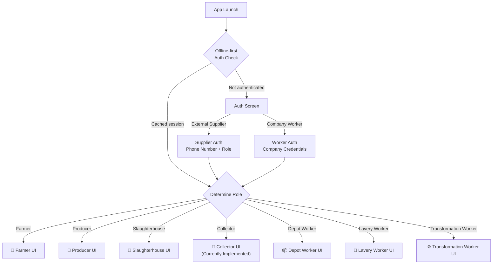

# Nassaj (نسّاج) — App Vision & Architecture

## Overview

Nassaj is a **single mobile application** that serves two distinct user groups within the wool supply chain — **external suppliers** (farmers, producers, slaughterhouses) and **internal company workers** (collectors, depot workers, lavery workers, transformation workers). In production, these would be two separate apps, but for simplicity, they are unified into **one app with role-based routing**.

The app is **offline-first** by design.

---

## User Roles

The app supports **7 distinct user roles**, split across two authentication flows.

### External Users (Supplier Auth Screen)
These users authenticate via **phone number** (Algerian format: starts with `05`, `06`, or `07`, 10 digits).

| # | Role | Arabic | Description |
|---|------|--------|-------------|
| 1 | **Farmer** (Éleveur) | مربي | Sheep farmers who supply raw wool |
| 2 | **Producer** (منتج) | منتج | Wool producers |
| 3 | **Slaughterhouse** (Abattoir) | مسلخ | Butcher shops / slaughterhouses providing hides & wool |

> Each role gets a **dedicated UI** tailored to their specific workflow. UI details TBD.

### Internal Users (Company Worker Auth)
These are company employees who handle the wool processing pipeline.

| # | Role | French | Description |
|---|------|--------|-------------|
| 4 | **Collector** (Collecteur) | جامع | Field workers who collect wool from suppliers — **currently implemented screens** (Map, List, My Loads, Profile) |
| 5 | **Depot Worker** | عامل المستودع | Receives, weighs, and stores incoming wool at the depot |
| 6 | **Lavery Worker** | عامل الغسيل | Handles wool washing/cleaning operations |
| 7 | **Transformation Worker** | عامل التحويل | Manages wool transformation/processing |

> Each role gets a **dedicated UI** tailored to their specific workflow. UI details TBD.

---

## Architecture: Single App, Role-Based Routing



### Current Implementation Status

| Role | Auth | UI Screens | Status |
|------|------|-----------|--------|
| Farmer | ✅ Phone auth | ❌ Placeholder | Stub only |
| Producer | ✅ Phone auth | ❌ Placeholder | Stub only |
| Slaughterhouse | ❌ Not yet | ❌ Not yet | Not started |
| **Collector** | ✅ Phone auth | ✅ **Map, List, My Loads, Profile** | **Fully implemented** |
| Depot Worker | ❌ Not yet | ❌ Not yet | Not started |
| Lavery Worker | ❌ Not yet | ❌ Not yet | Not started |
| Transformation Worker | ❌ Not yet | ❌ Not yet | Not started |

---

## Offline-First Strategy

> [!IMPORTANT]
> The app must work **without internet connectivity** as a primary mode of operation. Network is treated as an enhancement, not a requirement.

### Core Principles

1. **Local-first data**: All data is stored locally (Hive) and synced when connectivity is available
2. **Optimistic UI**: Actions are performed immediately on local data; sync happens in background
3. **Conflict resolution**: Server is the source of truth; last-write-wins with timestamp-based merging
4. **Sync queue**: Offline actions are queued and replayed when connectivity is restored

### Tech Stack for Offline

| Layer | Technology | Purpose |
|-------|-----------|---------|
| Local DB | **Hive** | Fast, lightweight NoSQL for structured data |
| Remote DB | **Supabase** | PostgreSQL backend + Auth + Realtime |
| Connectivity | **connectivity_plus** | Detect online/offline state |
| State | **flutter_bloc (Cubit)** | Reactive state management |
| Sync | Custom sync engine | Queue-based background sync |

### Sync Status Indicator

The Profile screen displays a persistent **Sync Status** card showing:
- Number of reports in the offline queue
- Visual indicator (orange dot = pending, green = synced)
- Manual sync trigger button

---

## Project Structure

```
lib/
├── main.dart                    # App entry, MultiBlocProvider
├── cubits/                      # State management
│   ├── auth_cubit.dart          # Auth state, role, phone validation
│   └── locale_cubit.dart        # FR/AR/EN language switching
├── l10n/                        # Localization
│   ├── app_localizations.dart   # Delegate + tr() lookup
│   ├── app_fr.dart              # French (primary)
│   ├── app_ar.dart              # Arabic
│   └── app_en.dart              # English
├── routes/
│   └── app_router.dart          # Named routes, role-based navigation
├── screens/
│   ├── auth_screen.dart         # Supplier authentication
│   ├── collection_map_screen.dart    # Collector: interactive map
│   ├── prioritized_orders_screen.dart # Collector: task list
│   ├── my_loads_screen.dart     # Collector: active job tracking
│   ├── profile_screen.dart      # Collector: profile + sync + logout
│   ├── producer_dashboard_screen.dart  # Producer: placeholder
│   ├── worker_dashboard_screen.dart    # Worker: placeholder
│   └── ... (future role-specific screens)
├── widgets/
│   └── map_bottom_nav_bar.dart  # Collector bottom navigation
├── utils/
│   └── toast_utils.dart         # Reusable animated error toast
└── models/
    └── operation.dart           # Data models
```

---

## Localization

The app supports **3 languages** with French as the primary:

| Language | Code | Direction | Primary For |
|----------|------|-----------|-------------|
| **French** | `fr` | LTR | Default / Main |
| **Arabic** | `ar` | RTL | Local users |
| **English** | `en` | LTR | Fallback |

Language can be switched from:
- The **Auth screen** (top language pills)
- The **Profile screen** (language selector card)

---

## Design Identity

| Token | Value |
|-------|-------|
| Background | `#F3F4F6` (light grey) |
| Auth Background | `#0C1222` (dark navy) |
| Primary Accent | `Colors.orange` / `#DF7E44` |
| Cards | White, `border-radius: 24px`, subtle shadow |
| Typography | `Google Fonts: Inter` (UI), `Cairo` (Arabic) |
| Nav Bar | Frosted white, rounded top corners, floating FAB |
| Toast | Slide-up from bottom, red accent, auto-dismiss 3s |

---

## Next Steps

- [ ] Define and implement **Slaughterhouse** auth role
- [ ] Split auth flow: **Supplier Auth** vs **Company Worker Auth**
- [ ] Design dedicated UIs for each of the 7 roles
- [ ] Implement Hive-based offline data layer
- [ ] Build sync queue engine with Supabase
- [ ] Add company worker authentication mechanism
